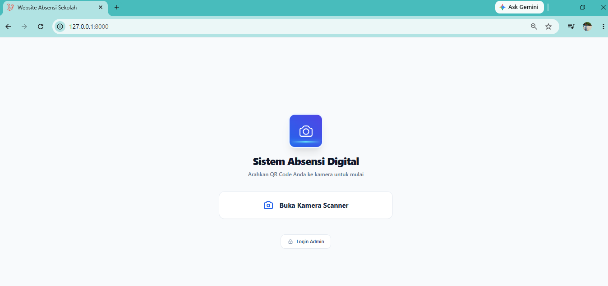
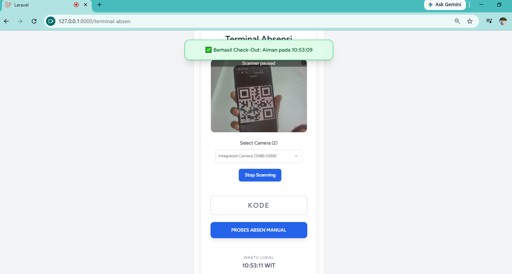
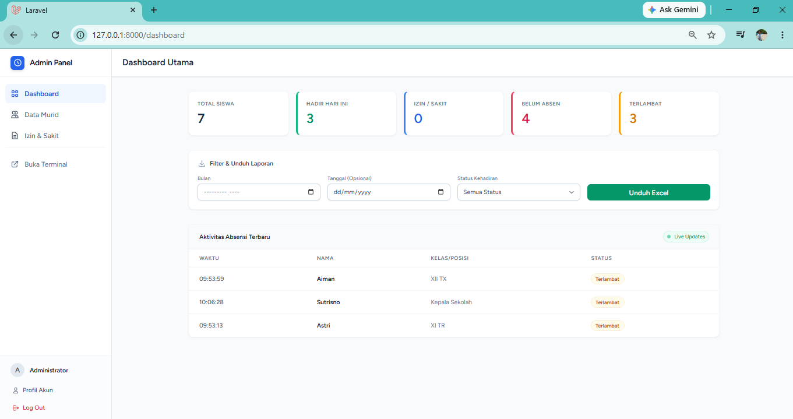
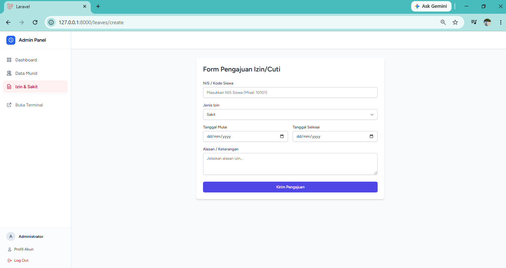
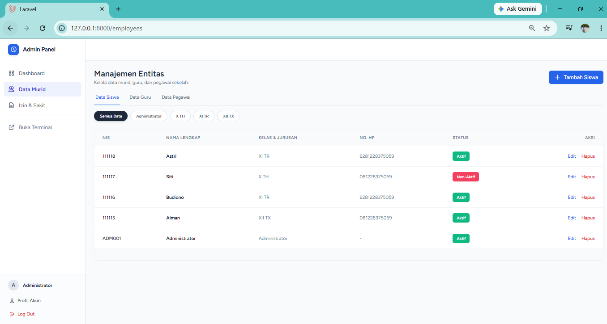

# 📸 Sistem Absensi Digital Kiosk

Sebuah aplikasi Kiosk Absensi Digital berbasis web modern yang memungkinkan pencatatan kehadiran secara *real-time* melalui pemindaian QR Code. Dibangun dalam *sprint* 15 hari dengan fokus pada performa interaktif, keamanan validasi, dan pengalaman pengguna (UX) yang mulus baik di perangkat *desktop* maupun *mobile*.

## ✨ Fitur Utama

*   **Real-time QR Code Scanner:** Integrasi kamera langsung menggunakan `HTML5-QRCode` untuk pemindaian instan tanpa perlu memotret/mengunggah gambar.
*   **Keamanan & Validasi Kiosk:** 
    *   Sistem secara otomatis menolak akses jika status entitas/karyawan `inactive`.
    *   Menampilkan pop-up notifikasi visual (⚠️) untuk akses ditolak.
    *   Jeda pintar (Kamera terjeda 4 detik setelah *scan* invalid untuk mencegah *spamming*).
*   **Interaktivitas Tanpa Reload:** Panel admin dilengkapi tombol *toggle* interaktif berbasis Livewire Volt untuk mengubah status (Active/Inactive) secara instan.
*   **Database Relasional yang Aman:** Menampilkan nama asli pengguna di layar Kiosk dengan penerapan pemanggilan *null-safe* (`?->`) untuk mencegah *error* relasi data.
*   **Desain Responsif:** Antarmuka bersih dan terstruktur yang dibangun dengan Tailwind CSS (dioptimalkan via Vite).

## 🛠️ Tech Stack

*   **Backend:** Laravel 11, PHP 8.3
*   **Frontend:** Livewire Volt, Tailwind CSS, Vite
*   **Database:** PostgreSQL
*   **Library Tambahan:** HTML5-QRCode

## 🚀 Panduan Instalasi Lokal

1. **Clone Repositori:**
    git clone [https://github.com/Ackermann17/absensi-app.git]
    cd nama-repo
2. **Instalasi Dependensi:**
    composer install
    npm install
3. **Konfigurasi Environment:**
    //Duplikat file .env.example menjadi .env dan atur koneksi PostgreSQL Anda.
    cp .env.example .env
    php artisan key:generate
4. **Migrasi Database:**
    php artisan migrate
5. **Kompilasi Aset & Jalankan Server:**
    npm run build
    php artisan serve --host 0.0.0.0 --port 8000

Catatan Pengujian Kamera di HP (Localhost):
Jika menguji fitur scanner via IP lokal di perangkat mobile, aktifkan flags Insecure origins treated as secure pada Chrome (chrome://flags/#unsafely-treat-insecure-origin-as-secure) dan masukkan IP lokal server (contoh: http://192.168.1.x:8000) agar akses kamera tidak diblokir.

## 🖼️ Tangkapan Layar (Screenshots)

**Tampilan Awal**

Proyek ini dikembangkan sebagai bagian dari sprint tantangan 15 Hari.